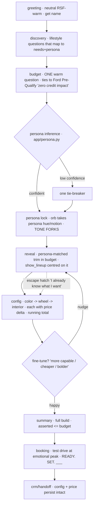

# Miles 3.0 — Restructuring Blueprint (repo-grounded)
### From broad lifestyle intake → to a persona-driven, budget-anchored, capability-first story

**For:** Ready Set Ford / Miles POC team
**Inputs:** Miles 2.0 Strategy POV · RSF .5 Playbook · Ford.com lineup & finance tools · **the actual repo** (`lilycoanvml/Miles-POC-.com`)
**Pairs with:** `Miles_3.0_ClaudeCode_Prompt.md` (the developer build brief)

> This version is written against the real code. Where the generic plan said "add a new state machine," the repo already *has* one — so this is an **evolution of the existing design**, not a rebuild. Runtime stays **Gemini Live (voice-first)**; Claude Code is only the tool that edits the repo.

---

## 1. The thesis (unchanged, now anchored to your code)

Miles today greets, runs a warm lifestyle chat (`passenger_count, driving_environment, daily_car_use, weekend_vibe`), then **reveals a vehicle hard-locked to the F-150 Lariat** and configures cosmetics (color → wheel → interior). Three research findings reframe it:

1. **Audience = the undecided explorer** (71% enter with no clear pick, bounce, overload). Miles must **narrow**, not display.
2. **Trim/capability is the foundation**, not paint. Lead with fit; cosmetics last.
3. **Price is the dominant 2026 emotion** (affordability #1; price-free reads as less credible; silent price-climb = abandonment). Budget is a first-class input.

The single mechanism that serves all three **and** is natively RSF: **infer a persona (Build / Thrill / Adventure) from the discovery answers, use it to pick the recommended trim, anchor everything to a stated budget, and let Miles narrate in that persona's voice.**

> **One line:** *Tell me what you need and what you'll spend — I'll build the one Ford that fits, in budget, and give you a reason to go drive it.*

Your current design is closer than it looks: the discovery question *"chasing trails and campsites… or working on a big project close to home?"* already separates **Adventure vs Build**. We're making that signal *deterministic*, adding **budget** and **Thrill**, unlocking the reveal, and forking the tone.

---

## 2. What changes — mapped to real files

| Change | Today | Target | Files that move |
|---|---|---|---|
| Discovery fields | 4 lifestyle fields | Needs-mapped fields that also score persona | `app/state.py` (`PROFILING_FIELDS`), `system_prompt.md` (taskflow), `tools.json`/`tools.py` (`save_user_insight` enum) |
| Narrowing | none; reveal locked | **Persona inference** → recommended trim | new `app/persona.py`; `app/state.py` (persona fields); `content/personas/**` |
| Reveal | `LOCKED_MODEL="f-150-lariat"` | Persona-driven recommendation (deep-build where a Tier-2 tree exists) | `app/state.py`, `app/tools.py::h_select_model`, `car_configurations.json` |
| Budget | absent; price hardcoded | Captured early; running total; summary ≤ budget | new `app/budget.py`; `car_configurations.json` (prices); `frontend/src/config/spec.ts` (`PRICING`), new budget HUD |
| Build order | color→wheel→interior | Same order, but **after** trim/powertrain and **price-bound** | `system_prompt.md`, `app/tools.py` (option deltas) |
| Tone | one voice, static prompt | **Persona-adaptive**, injected per turn | `system_prompt.md` (base), `content/personas/<p>/tone.md`, `app/state.py::render_block` |
| Choice load | one hero + carousel | Keep; add "nudge me" fine-tuning + ≤3 options | `system_prompt.md` taskflow |
| Handoff | booking payload | Carry full config **+ price** intact | `app/tools.py::h_book_test_drive`, `types.ts` |

---

## 3. The persona system (the spine)

Personas are the RSF mindsets, **inferred, never demanded** (asking "are you a Build person?" recreates overload). A few discovery answers score all three; the dominant anchors the recommendation; blends are allowed; low confidence triggers **one** tie-breaker (fits the 40-word/one-question voice constraint).

### 3.1 Persona → mindset → your current lineup

| Persona | RSF prompt | Optimizes for | In the **current 6-vehicle** KB |
|---|---|---|---|
| **BUILD** | *"What do you need to get done?"* | Capability, logic, safety, tech, tow/haul | F‑150, Super Duty, Transit, E‑Transit, Maverick (work) |
| **ADVENTURE** | *"Where do you want to go?"* | Terrain, accessories, freedom | Ranger, Maverick (off-road framing); *Bronco/Bronco Sport when added* |
| **THRILL** | *"What makes it fun for you?"* | Performance, presence, the drive | **Thin today** — needs Raptor/Lobo trims or Mustang/Mach‑E added |

> **Honest gap:** your POC is trucks & vans only, so **Build and Adventure are well-served; Thrill has no native home** until you add performance trims (F‑150 Raptor, Ranger Raptor, Maverick Lobo) or the Mustang/Mach‑E/Bronco side of the lineup. Treat Thrill as a **content-expansion item** — the logic ships now, the vehicles fill in. (See §6.4.)

### 3.2 The trim *is* the persona

Same nameplate, different persona **by trim** — which is exactly why "trim is the foundation" and why persona is the right narrowing tool:

- **F‑150 XL/XLT/Lariat** → Build · **F‑150 Raptor** → Thrill · **F‑150 Tremor/FX4** → Adventure
- **Maverick XL** → Build · **Maverick Lobo** → Thrill · **Maverick Tremor** → Adventure

Persona narrows the *model set*; needs + budget resolve the *trim*. Your KB's Tier‑1/Tier‑2 split already supports this — Tier‑1 is awareness, Tier‑2 is the buildable trim.

### 3.3 Inference (transparent scoring, lives in `app/persona.py`)

Each discovery answer adds weights to `{build, thrill, adventure}`; dominant = max; confidence = margin over runner-up. Weights live in `content/personas/<p>/persona.json` so they're tunable without code.

| Discovery answer (keep it lifestyle-framed) | Signal |
|---|---|
| "big project close to home / hauling / job site" | Build ↑ |
| "trails, campsites, backroads, getting off the map" | Adventure ↑ |
| "the drive itself / something with presence" | Thrill ↑ |
| passengers & daily use | Build/Adventure split + trim sizing |
| gas / hybrid / EV comfort *(new, 1 question)* | powertrain framing (hybrid = low-risk "best of both") |
| "how much does every safety system standard matter?" *(fold into Build)* | Build ↑; gates peace-of-mind copy |

Keep the **warm, human framing** the current prompt insists on — just make each question map cleanly to a signal. Safety/tech buyers live inside **Build**; frame as *protection & control*, never surveillance.

---

## 4. The new flow (fits voice-first + the existing phase machine)

The phases already exist in `app/state.py`. We **rename/extend** them and add **budget** + **persona lock**. Because of the 40-word/one-question limit, new steps *replace* turns (needs questions) or add **at most one** (budget); persona is inferred silently (0 extra turns).



**Mapping to `PHASES`:** `greeting → discovery → budget(new) → reveal → config → booking → crm`. (`lineup` folds into the reveal as it already does via `show_lineup`.) Persona lock is a state transition inside `reveal`, not a screen.

### 4.1 Anti-choice-overload rules (product laws)
- **Never a wall** — ≤3 options per step; one is the recommended hero (your reveal already does hero + carousel; drive the hero from persona).
- **Recommend, then offer** — always a pick *and the reason it fits you* before alternates.
- **Fine-tuning is first-class** — every step accepts "more capable / cheaper / bolder" and re-tunes. This serves the "interested but needs refinement" audience.
- **Budget is quiet but always there** — persistent HUD; expandable; never a surprise.
- **Escape hatch** — the existing FAST-PATH in `system_prompt.md` becomes the "I already know what I want" jump.

---

## 5. Miles's voice: storyteller, persona-adaptive, RSF-true

RSF voice = **Inspiring, Determined, Impassioned**; benefit over feature (*"free those hands up,"* not *"BlueCruise"*); simple, punchy, action-oriented. Use **READY. SET. ___** only at the booking peak, only from the approved bank, never "READY. SET. [pillar]."

**The tone forks at persona lock.** Before that, Miles is neutral RSF-warm (as today). After, the same beat is spoken three ways. These deltas live in `content/personas/<p>/tone.md` and are injected via the per-turn `<system-reminder>` (see §6.3).

| Beat | BUILD (grounded, competent) | THRILL (energetic, swagger) | ADVENTURE (open, exploratory) |
|---|---|---|---|
| Budget | *"What's the number that keeps this smart? I'll keep every choice inside it."* | *"Set your range — every upgrade one you'll love, none you'll regret."* | *"Give me your range; I'll make the gear fit the budget, not the reverse."* |
| Reveal | *"This one earns its keep — F‑150. Capability for your haul, every safety system standard."* | *"Here it is — the one you take the long way home in."* | *"Meet your trail partner — the one that says yes when the map runs out."* |
| Fine-tune | *"Want more muscle, or a leaner number?"* | *"More edge, or dial it back?"* | *"More trail-ready, or lighter on the wallet?"* |
| Book (peak) | *"Built, and in budget. READY. SET. Get behind the wheel."* | *"She's ready. READY. SET. Feel it for real."* | *"Ready for the trailhead. READY. SET. Go see it."* |

Each still respects the **40-word, one-question** rule.

---

## 6. Architecture — grounded in the real repo

Two moves: (1) push persona/tone/price **content into data** so non-engineers iterate it; (2) **extend the existing state machine + tool layer** rather than replace them. The 3D/material pipeline (`three/CarModel.tsx`, `config/materials.ts`) is preserved untouched.

```
BACKEND (Python · FastAPI · Gemini Live)
  app/state.py        ← extend: needs fields, budget, persona{scores,dominant,confidence}; new phases; render_block() adds persona+tone cue
  app/persona.py      ← NEW pure module: score(profile) -> {scores, dominant, confidence}
  app/budget.py       ← NEW pure module: running_total(state), option_delta(id), in_budget(state)
  app/tools.py        ← extend gating; new set_budget tool; unlock h_select_model; option handlers return price delta
  car_configurations.json ← add persona tags + prices to lineup; add prices to options; (later) more Tier-2 trims
  tools.json          ← add set_budget; widen select_model beyond the lock; add persona/budget enums
  system_prompt.md    ← base voice + new taskflow order (discovery→budget→persona reveal→config); keep 40-word rule
  content/personas/{build,thrill,adventure}/  ← persona.json · tone.md · lines.json   (the "backend persona folders")
  app/agent.py        ← inject active persona tone via the per-turn <system-reminder> (already the seam)

FRONTEND (React · Vite · R3F — no state lib, plain useState in App.tsx)
  config/spec.ts      ← PRICING becomes a function of the live config + a price map; summary shows in-budget total
  new BudgetHud       ← persistent running-total chip (reads ToolEvent.config + prices)
  screens/RevealScreen.tsx ← orb hue/motion from persona (add a `persona` prop)
  screens/SummaryScreen.tsx ← assert & display total ≤ budget; show payment framing
  three/*             ← UNCHANGED (preserve the morph + material application)
  types.ts            ← extend ToolEvent/StageState with persona, budget, runningTotal
```

### 6.1 Persona data folders (the requested backend folders)
```
content/personas/build/
  persona.json   # id, label, rsfPrompt, scoringWeights, priorityOptionCategories, orbSignal{hue,motion}
  tone.md        # voice delta injected per-turn once persona locks (seed: §5)
  lines.json     # approved RSF modular lines (peaks only) + beat microcopy
```
A copywriter/strategist tunes voice, the persona→trim map, and budget tiers by editing these — no code deploy.

### 6.2 Extended `SessionState` (in `app/state.py`)
Add to the existing dataclass:
```python
budget: dict = field(default_factory=dict)      # {"min":..,"max":..,"monthly":..}
persona: dict = field(default_factory=dict)      # {"scores":{...},"dominant":..,"confidence":..}
running_total: int = 0
# PROFILING_FIELDS -> needs-mapped set, e.g.
# ["life_mode","passengers","daily_use","powertrain_comfort"]  (+ safety folded in)
```
`phase` (the derived property) gains a `budget` step between `discovery` and `reveal`; `LOCKED_MODEL` is replaced by `recommend_trim(state)` reading persona + budget + catalog.

### 6.3 Tone injection without a mid-session prompt swap
Gemini Live sets its system instruction once at session start (`_render_system_prompt`). Persona is discovered later — so inject the **active persona's `tone.md` delta through the existing per-turn `<system-reminder>`** that already carries `[STATE]`. Extend `render_block()` to append `persona=<dominant>` plus a compact tone cue once locked. Minimal change, uses a seam that's already there.

### 6.4 Unlocking the reveal (the one real dependency)
Today only `f-150-lariat` has a Tier‑2 config tree, and `h_select_model` rejects everything else. To vary the recommendation:
- **Phase-1 (ships now):** persona picks the recommended **Tier‑1** vehicle for framing/reveal; deep-build still resolves to whatever has a Tier‑2 tree. Miles can honestly recommend a Ranger for an Adventure buyer, reveal it, then deep-build on the F‑150 as the demo path — **or** you gate deep-build to "coming soon" for non-F‑150 picks.
- **Phase-2 (content):** add Tier‑2 trees (colors/wheels/interiors/**prices**) for more trims to make the deep-build fully persona-accurate. This is data work in `car_configurations.json`, not logic.

---

## 7. Budget as a first-class citizen

- **Capture early, one warm question.** Right after discovery. Tie to Ford's real **Pre-Qualify — "Know your budget. Zero credit impact."** and the payment calculator (copy framing; no real credit integration in POC).
- **Constrain, don't hide.** `recommend_trim` filters to ≤ `budget.max`; each option in config shows a **price delta** (`app/budget.py`), and the **`PRICING` block in `spec.ts` becomes dynamic** off the live config.
- **Persistent running total** — a quiet HUD; expandable to a mini payment estimate.
- **Summary guaranteed in-budget** — assert `running_total ≤ budget.max` before the summary renders. This is the direct antidote to cart abandonment.
- **Over-budget reach → honest trade-off** (*"that pushes you to $X/mo — want it, or should I find the same feel for less?"*). Honesty builds the 2% dealer trust the market lacks.

---

## 8. The conversion mechanism (why this books drives)

Engagement ≠ intent. The deliberate mechanism is **co-authorship + a peak-timed ask**: the user co-builds a vehicle that is *theirs* (their needs, their budget, their persona) → the ask lands at the finished, in-budget peak with an RSF line → the CTA is a **test drive** (66% want to physically experience it). Miles hands off a warm, configured, committed shopper.

---

## 9. How to iterate (operating model)

**Ship behind a flag.** Keep Miles 2.0 runnable (`MILES_FLOW=miles2`); build 3.0 phase-by-phase behind `miles3`. Two independent loops:
- **Content loop (no engineer):** edit `content/personas/**` and `car_configurations.json` for tone, persona→trim map, budget tiers, RSF lines.
- **Experience loop (Claude Code + engineer):** persona/budget modules, state/tool changes, frontend HUD — small PRs, each testable.

**Measure & learn (from the POV):** booking rate · drop-off by phase · budget-capture rate · persona distribution & confidence · fine-tune usage · config-depth↔booking · in-budget-summary rate.

**A/B worth running:** budget before vs. after persona lock · persona inferred silently vs. lightly confirmed · 2 vs. 3 options per step.

---

## 10. Risks & guardrails

- **Thrill has no vehicles yet** → ship logic now; flag Thrill trims/models as content backlog (§3.1, §6.4).
- **Persona feels like a box** → infer silently, allow blends, always allow fine-tune + escape hatch.
- **Budget-first kills the story** → warm persona-voiced framing; total quiet until decision points.
- **Voice-first constraints** → new steps replace turns; budget = 1 question; persona = 0. Respect the 40-word rule.
- **Mid-session tone** → inject via per-turn reminder, don't try to swap the Gemini system instruction.
- **3D regressions** → never touch `three/*` or material node names; drive visuals from state only.
- **RSF line misuse** → pull only from `lines.json`; peaks only; never "READY. SET. [pillar]".

---

## 11. Immediate next steps
1. Approve persona→trim mapping + budget tiers; add real 2026 prices to `car_configurations.json`.
2. Copywriting pass on the three `tone.md` + `lines.json` (seed = §5).
3. Decide the Thrill path (add Raptor/Lobo trims, or defer Thrill).
4. Hand `Miles_3.0_ClaudeCode_Prompt.md` to Claude Code — it begins with a repo audit and ships behind the `miles3` flag.
5. Stand up the §9 analytics before flipping phases live.
